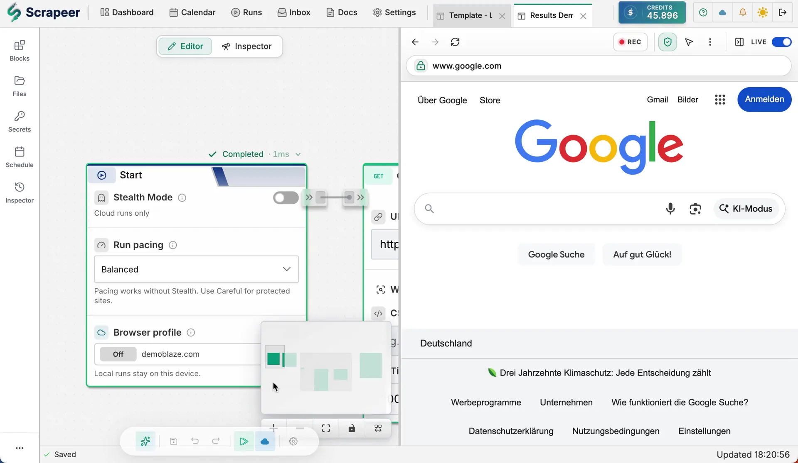

<p align="center">
  <a href="https://www.scrapeer.com">
    
  </a>
</p>

<h1 align="center">Scrapeer MCP Server</h1>

<p align="center">
  Run Scrapeer visual web-scraping flows from Claude Code, Codex, Cursor, and VS Code Copilot.
</p>

[Scrapeer](https://www.scrapeer.com) is a visual browser automation and web scraping platform for people who do not want to write scrapers from scratch. Build deterministic scraping workflows in a drag-and-drop editor, watch the browser run step by step, then run those same flows locally or in Scrapeer's cloud.

This MCP server connects AI agents to Scrapeer so they can:

- run saved scraping flows and retrieve structured results
- inspect flow definitions, block configs, execution steps, and run history
- create or patch flows using Scrapeer's block catalog and validation APIs
- check account credits and cancel active cloud runs

The result is a useful split of responsibilities: humans design reliable browser workflows in Scrapeer, and agents can trigger, monitor, debug, and extend those workflows through MCP.

<p align="center">
  
</p>

## Why Scrapeer

Scrapeer is built for glass-box scraping: you can see exactly what the scraper does, inspect each block's output, and fix the workflow when a site changes. Instead of asking an agent to improvise browser steps every time, Scrapeer gives agents a reliable set of saved, validated workflows they can run on demand.

## Quick Start

Create a Scrapeer API key at [https://app.scrapeer.com/settings#security](https://app.scrapeer.com/settings#security), then add the server to your MCP client. These examples use `npx` so users do not need to install the package globally.

### Claude Code (`.mcp.json`)

For a project-scoped Claude Code config, create `.mcp.json` in the project root:

```json
{
  "mcpServers": {
    "scrapeer": {
      "command": "npx",
      "args": ["-y", "@scrapeer/mcp-server"],
      "env": { "SCRAPEER_API_KEY": "sk_..." }
    }
  }
}
```

For a private user-scoped config, run `claude mcp add --scope user --env SCRAPEER_API_KEY=sk_... scrapeer -- npx -y @scrapeer/mcp-server` so Claude writes the correct `~/.claude.json` entry for your machine.

### Codex CLI and IDE extension (`~/.codex/config.toml`)

```toml
[mcp_servers.scrapeer]
command = "npx"
args = ["-y", "@scrapeer/mcp-server"]

[mcp_servers.scrapeer.env]
SCRAPEER_API_KEY = "sk_..."
```

### Cursor (`~/.cursor/mcp.json` or `.cursor/mcp.json`)

```json
{
  "mcpServers": {
    "scrapeer": {
      "type": "stdio",
      "command": "npx",
      "args": ["-y", "@scrapeer/mcp-server"],
      "env": { "SCRAPEER_API_KEY": "sk_..." }
    }
  }
}
```

### VS Code Copilot (`.vscode/mcp.json`)

```json
{
  "servers": {
    "scrapeer": {
      "type": "stdio",
      "command": "npx",
      "args": ["-y", "@scrapeer/mcp-server"],
      "env": { "SCRAPEER_API_KEY": "sk_..." }
    }
  }
}
```

## Available Tools

### Read

| Tool | Description |
|------|-------------|
| `scrapeer_list_flows` | List your saved scraping flows |
| `scrapeer_get_flow` | Get details about a specific flow |
| `scrapeer_get_block_catalog` | List the block types available for use in flows, with their custom-field schemas. Call this before any create/update/patch; guessing types or config keys leads to validation failures |
| `scrapeer_validate_flow` | Dry-run validate a flow JSON without saving |
| `scrapeer_get_account` | Account info: credit balance, subscription plan, cloud-run availability |

### Run

| Tool | Description |
|------|-------------|
| `scrapeer_run_flow` | Trigger a cloud run and return immediately with an execution ID |
| `scrapeer_run_flow_and_wait` | Run a flow and poll until results are ready (recommended) |
| `scrapeer_get_run_status` | Check the status of a running or completed execution |
| `scrapeer_get_run_results` | Get structured output data from a completed run |
| `scrapeer_get_run_steps` | Get block-by-block execution breakdown (useful for debugging failures) |
| `scrapeer_list_runs` | List execution history, with optional filtering by status or flow |
| `scrapeer_cancel_run` | Cancel an active cloud execution |

### Mutate

| Tool | Description |
|------|-------------|
| `scrapeer_create_flow` | Create a new (empty) flow with the given title |
| `scrapeer_update_flow` | Replace a flow's entire definition (whole-flow overwrite). Prefer `scrapeer_patch_flow` for incremental edits |
| `scrapeer_patch_flow` | Apply granular patch operations: add_block, update_block_custom, remove_block, add_edge, remove_edge |

### Building flows: recommended sequence

The mutation tools enforce **optimistic concurrency**. Every save sends the version stamp the caller saw on its last read, and the gateway rejects stale writes with 409 so concurrent edits from a human in the editor and an LLM via MCP cannot silently overwrite each other. The MCP server tracks this version stamp automatically across calls in the same session, so the LLM does not have to manage it manually.

Typical sequences:

**Create from scratch:**
```
scrapeer_get_block_catalog       -> learn valid block types
scrapeer_create_flow             -> returns flow_id (event_id cached)
scrapeer_patch_flow flow_id [...] -> add_block ops; cache -> baseProjectEventID
```

**Modify an existing flow:**
```
scrapeer_get_block_catalog       -> learn valid block types
scrapeer_get_flow flow_id        -> caches the current event_id
scrapeer_validate_flow {...}     -> optional dry-run before commit
scrapeer_patch_flow flow_id [...] -> uses cached event_id automatically
```

If a 409 fires, the cached event_id is invalidated automatically. Re-call `scrapeer_get_flow` and retry the mutation.

## Configuration

| Variable | Required | Default | Description |
|----------|----------|---------|-------------|
| `SCRAPEER_API_KEY` | Yes | - | API key from app.scrapeer.com/settings |

## Development

```bash
pnpm install
pnpm test
pnpm run build
```

Tests use [msw](https://mswjs.io/) to mock the Scrapeer API. No real credentials are needed.

## Publishing

Registry name: `com.scrapeer/mcp-server`

Before publishing, keep these versions in sync:

- `package.json` -> `version`
- `server.json` -> top-level `version`
- `server.json` -> `packages[0].version`
- `src/index.ts` -> `McpServer({ version })`

Release checklist:

```bash
pnpm install
pnpm audit
pnpm test
pnpm run build
pnpm pack --dry-run
pnpm publish --access public
```

After the npm package exists, publish the metadata to the official MCP Registry:

```bash
mcp-publisher login dns --domain scrapeer.com --private-key "$MCP_REGISTRY_PRIVATE_KEY"
mcp-publisher publish
```

The npm package must include `mcpName: "com.scrapeer/mcp-server"` in `package.json`; the value must match `server.json`.
